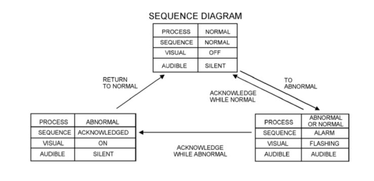
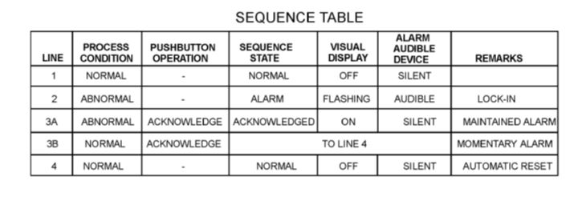
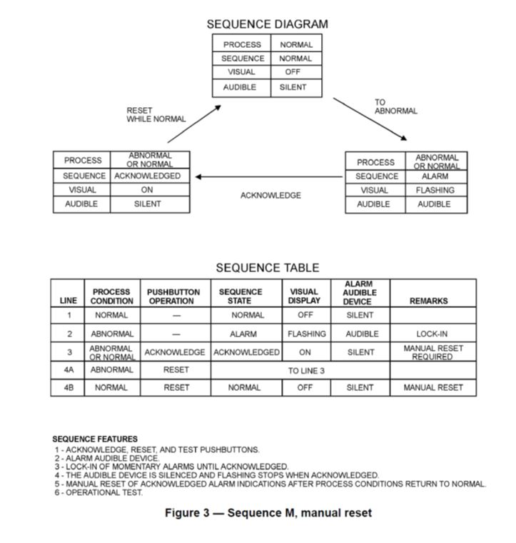
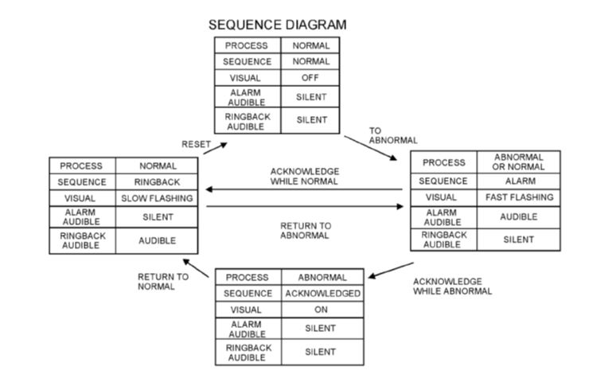
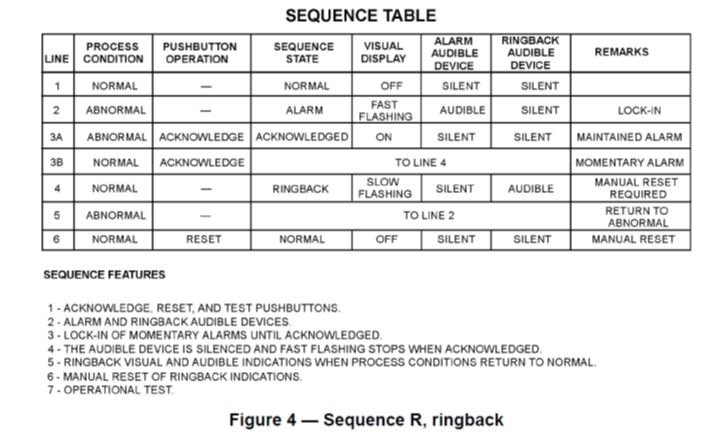
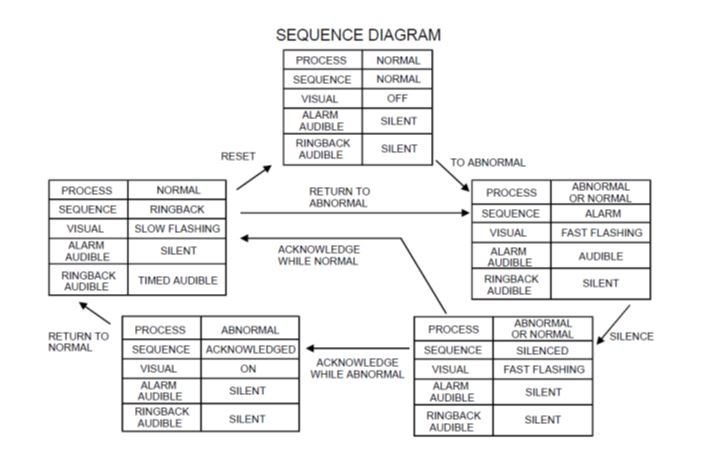
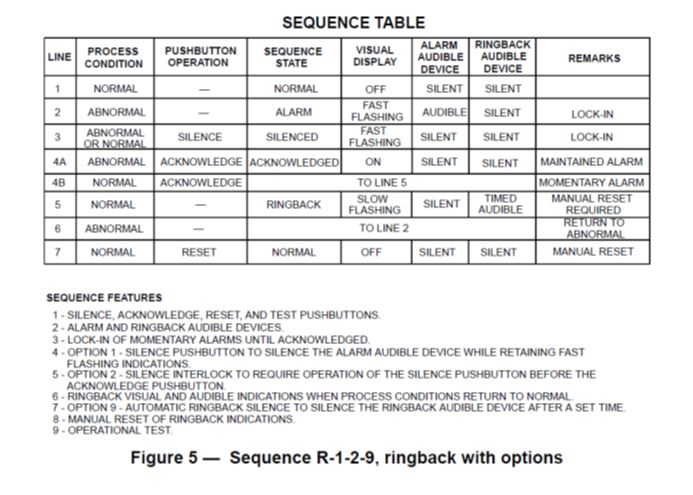

In process industry the information about the event which may lead to a catastrophic situation need to be acknowledged with utmost care. The alarm annunciator is such a component which will inform operator using audio and visual indication. As we all are aware that the process plants are divided into two major areas viz. plant area and control room area. Generally control rooms are always away from the plant for safety reasons. The operators who are operating the plant are remotely operating the plant seating in the control room. It will not be always possible for the operator to monitor the process parameters continuously. In case, due to malfunction of regulatory controller or any process component, the operator has to take control of the plant and drive it smoothly to the safe region. The main hurdle in this crucial task is to indicate the occurrence of the event to the operator in shortest possible time. It is also true that the attention of the operator needs to be drawn to the console in such a situation. This task can be accomplished by two ways, by flashing a window or switching on the hooter.

The ISA (International Society for Automation) standardized the sequence of operation to attain the uniformity in handling safety issues across the globe. The ISA published the standard for annunciator ISA-18.1-1979 (R2004) Formerly ISA-18.1-1979 (R1992). The standard clearly defines in which situation which sequence f event to take place.

## Alarm Annunciator:
 It is a device which indicates occurrence of fault to the operator audio and visually. It is made up of number of windows equivalent to number of faults. A common sequence of operation is as follows:
 
 When an alarm is notified (process parameter crossing the set limit either high or low) the flashing of the notified window starts and the hooter also starts hooting, indicating it to the operator the presence of fault. The operator will acknowledge the event by pressing an "Acknowledge" push button. The moment operator acknowledges the flasher stops making the window to glow continuously, indicating fault is still there, and hooter also stops. The operator takes corrective action, and he/she removes the event which caused fault and presses RESET button, closing the window which was glowing. This takes the alarm to come to its base location, and ready for next event. The other sequences are also notified by ISA and which can be referred to by the users. There are two types of contacts which are most commonly used viz.
 
* Make to alarm (Normally open)
* Break to alarm (Normally closed)

The users are required to develop the logic as per the standard sequence and test for its functionality. The broad flow chart is as follows:

The flow diagram for all three sequences is as follows:

